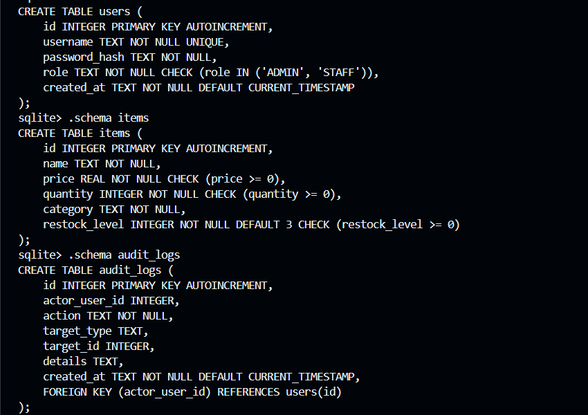
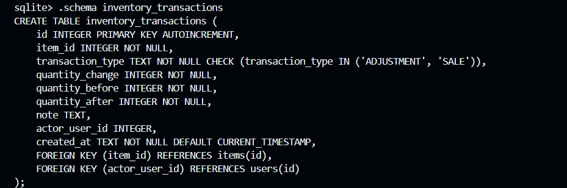
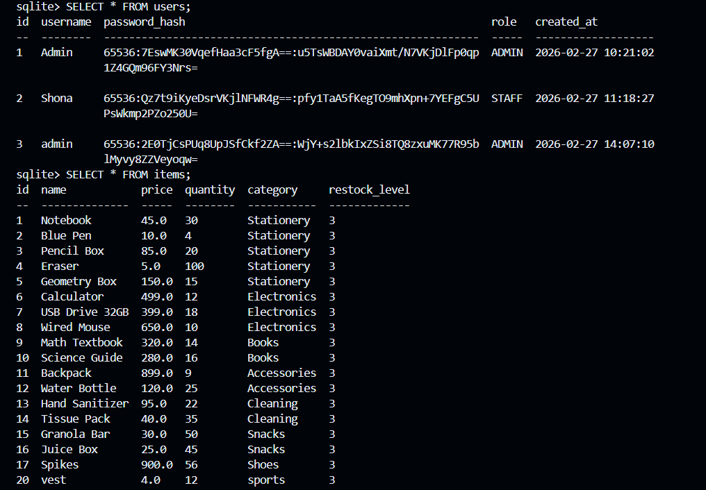
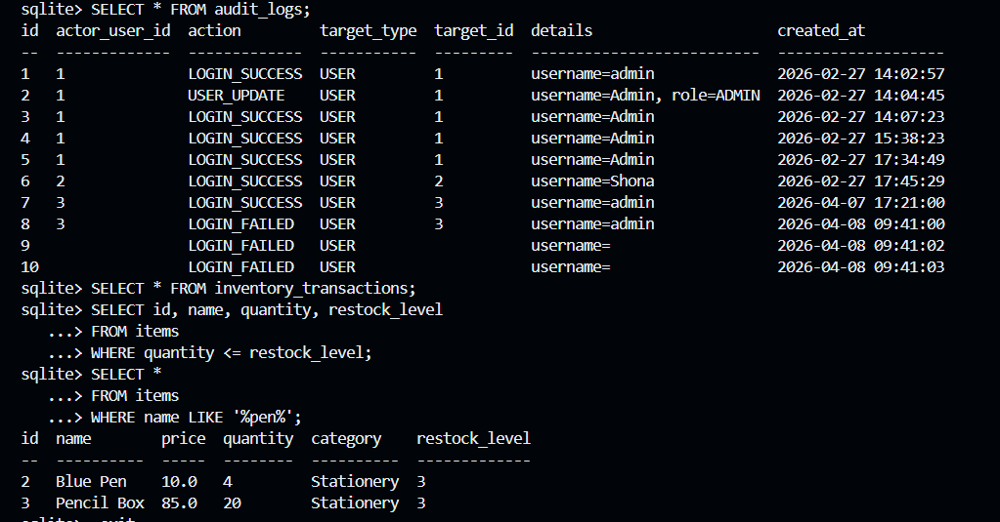
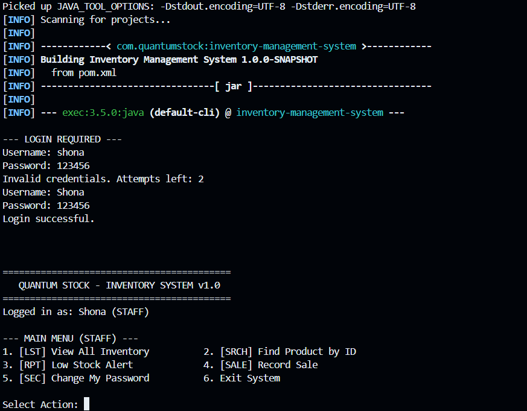
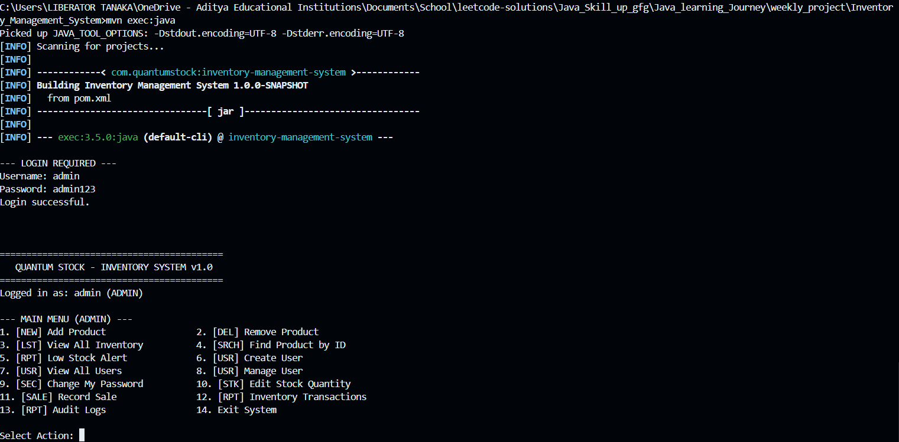
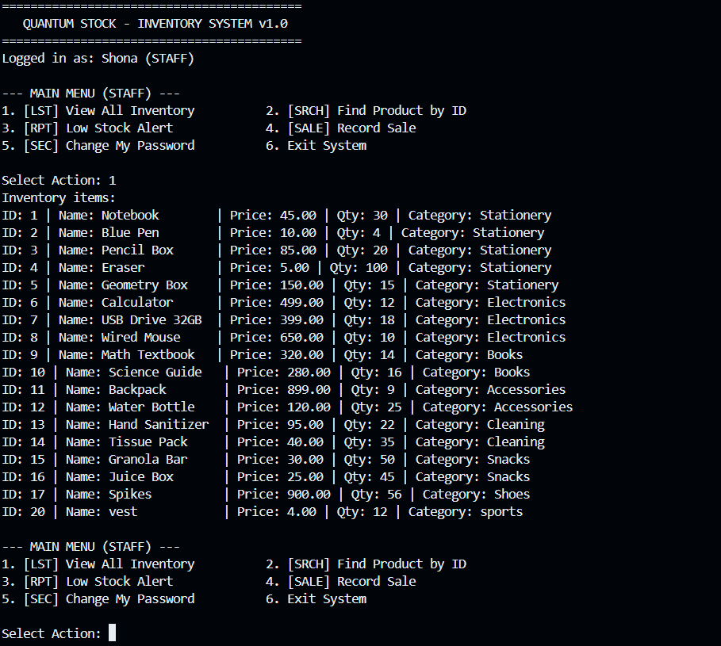
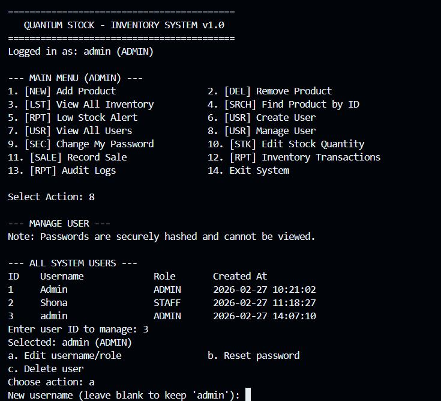
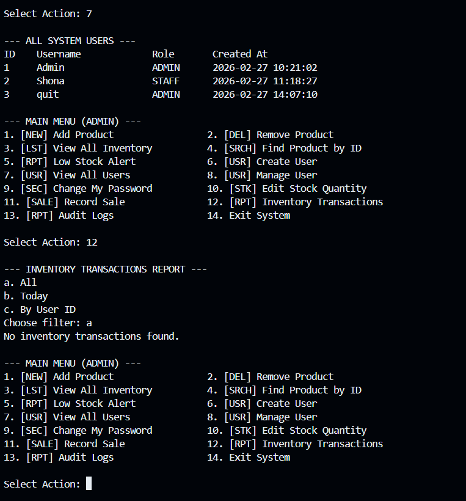
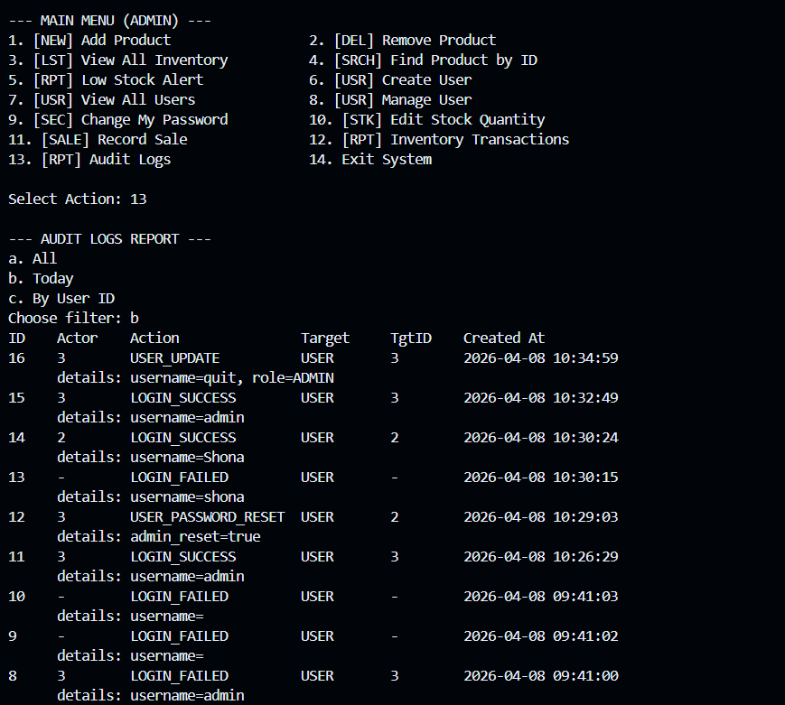

## Index

1. Abstract
2. List of Figures
3. List of Tables
4. Acronyms
5. Introduction
6. System Analysis
7. Technology Description
8. Database Design
9. System Design
10. System Implementation
11. Conclusion
12. Future Enhancements
13. References
14. Appendix

---

## Abstract

This project is a console-based `Inventory Management System` developed using `Java`, `JDBC`, and `SQLite`. The system is designed to manage products, users, stock movement, and audit activity in a persistent database. It supports role-based access for `ADMIN` and `STAFF`, item management, stock updates, sale recording, password security with hashed credentials, and reporting features for audit logs and inventory transactions. The project demonstrates practical application of Java programming, JDBC-based persistence, database design, and structured software development.

---

## List of Figures

1. Login Screen
2. Admin Main Menu
3. Inventory View
4. User Management Screen
5. Inventory Transactions Report
6. Audit Logs Report
7. SQLite Database Tables
8. Additional Database Table View
9. Sample Database Query Results
10. Additional SQL Query Output

---

## List of Tables

1. `items` table
2. `users` table
3. `inventory_transactions` table
4. `audit_logs` table
5. Feature Summary Table

---

## Acronyms

- `JDBC` - Java Database Connectivity
- `SQL` - Structured Query Language
- `DBMS` - Database Management System
- `PBKDF2` - Password-Based Key Derivation Function 2
- `CRUD` - Create, Read, Update, Delete
- `UI` - User Interface
- `ER` - Entity Relationship

---

## 1. Introduction

### 1.1 Brief Information About the Project

The `Inventory Management System` was developed to help manage product records, user accounts, stock updates, and sales in a structured and persistent way. The project replaces manual inventory tracking with a database-backed application that keeps information safe and accessible.

This is a `Java`-based console application created as a cornerstone academic project. The system uses `JDBC` to connect the Java application to a local `SQLite` database. The project focuses on solving inventory record management problems through authentication, item tracking, user management, and reporting.

### 1.2 Motivation and Contribution

Many small organizations and student labs still track stock manually or in basic spreadsheets. That creates issues such as duplicate entries, stock mismatch, weak accountability, and difficulty in tracking historical operations. The main contribution of this project is a simple but structured inventory solution that:

- digitizes item and user records
- introduces secure authentication with hashed passwords
- records sales and stock adjustments in a persistent database
- provides audit logs for accountability
- demonstrates practical JDBC-based persistence in Java

### 1.3 Objectives of the Project

- To build a Java-based inventory application
- To store data persistently using SQLite
- To implement JDBC-based database access
- To apply role-based access for system users
- To maintain stock transaction history and audit logs

### 1.4 Scope of the Project

The scope of this project includes a desktop-style console inventory system for small to medium use cases such as shops, departments, labs, or internal stock rooms. The current scope covers:

- secure login for admin and staff users
- product storage and retrieval
- stock adjustment and sale recording
- user management by administrators
- transaction and audit reporting

The project can be extended later with a graphical interface, analytics dashboard, multi-branch support, and cloud-hosted database options.

---

## 2. System Analysis

### 2.0 Problem Statement

Manual inventory tracking is time-consuming and error-prone. There is a need for a simple, affordable, and database-driven system that supports product management, secure access, and accurate stock monitoring.

### 2.1 Existing System

- Manual recording of inventory in notebooks or spreadsheets
- Difficult to track sales and stock changes
- No proper authentication or access control
- No audit trail for actions taken by users

### 2.2 Proposed System

- Centralized inventory records
- Persistent storage through SQLite
- Secure login with hashed passwords
- Admin and staff roles
- Transaction and audit reporting

### 2.3 Functional Requirements

- User login and authentication
- Add, remove, search, and view products
- Record product sales
- Edit stock quantity
- Manage users
- Generate reports

### 2.4 Non-Functional Requirements

- Simple console interface
- Data persistence
- Security for passwords
- Maintainability through modular design

### 2.5 Software Requirements

- Operating System: `Windows 10/11`
- Programming Language: `Java 17`
- IDE / Editor: `VS Code` or any Java-supported IDE
- Database: `SQLite`
- Connectivity Layer: `JDBC`
- Build Tool: `Maven`

### 2.6 Hardware Requirements

- Processor: `Intel i3` or above
- RAM: `4 GB` minimum
- Storage: enough space for JDK, Maven, project files, and SQLite database
- Input Devices: keyboard
- Display: standard monitor or laptop display

---

## 3. Technology Description

### 3.1 Java

- `Java 17`

Java is used as the main programming language for implementing the system logic, menu handling, input validation, authentication flow, and overall application structure.

### 3.2 JDBC

- `Java Database Connectivity`

JDBC acts as the bridge between the Java application and the SQLite database. It is used to open database connections, execute SQL statements, fetch query results, and manage transactions.

### 3.3 SQLite Database

- `SQLite`

SQLite is the persistent storage engine used in this project. It stores the application data in a local `.db` file and does not require a separate database server.

### 3.4 Maven

- `Maven`

Maven is used to manage dependencies, compile the project, and run the application or tests.

### 3.5 JUnit 5

- `JUnit 5`

JUnit 5 is used to verify password utilities and authentication-related flows.

### 3.6 Why These Technologies Were Used

Java provides object-oriented structure and strong library support. JDBC enables database communication from Java code. SQLite is lightweight and easy to distribute because the entire database is stored in a single `.db` file. Maven simplifies dependency management and project execution.

---

## 4. Database Design

### 4.1 Database Overview

The project uses an SQLite database stored locally at:

`data/inventory.db`

### 4.2 Tables Used

#### `items`

- `id`
- `name`
- `price`
- `quantity`
- `category`
- `restock_level`

#### `users`

- `id`
- `username`
- `password_hash`
- `role`
- `created_at`

#### `inventory_transactions`

- `id`
- `item_id`
- `transaction_type`
- `quantity_change`
- `quantity_before`
- `quantity_after`
- `note`
- `actor_user_id`
- `created_at`

#### `audit_logs`

- `id`
- `actor_user_id`
- `action`
- `target_type`
- `target_id`
- `details`
- `created_at`

### 4.3 Keys and Constraints

- Primary Keys:
- `items.id`
- `users.id`
- `inventory_transactions.id`
- `audit_logs.id`

- Foreign Keys:
- `inventory_transactions.item_id -> items.id`
- `inventory_transactions.actor_user_id -> users.id`
- `audit_logs.actor_user_id -> users.id`

- Constraints:
- `price >= 0`
- `quantity >= 0`
- `restock_level >= 0`
- `role` limited to `ADMIN` or `STAFF`
- usernames must be unique

### 4.4 Table Relationships

- `inventory_transactions.item_id` references `items.id`
- `inventory_transactions.actor_user_id` references `users.id`
- `audit_logs.actor_user_id` references `users.id`

The project uses relational links to keep data connected and meaningful. Transactions are tied to items and, when available, to the user who performed the action. Audit logs also capture the acting user, which helps maintain accountability and system traceability.

### 4.5 SQL / Schema References

- [schema.sql](../src/main/resources/db/schema.sql)
- [seed.sql](../src/main/resources/db/seed.sql)









---

## 5. System Design

### 5.1 System Architecture

The application follows a simple layered structure:

- `Main` handles console interaction and menus
- `AuthService` and `Inventory` handle business logic
- Repository classes handle JDBC persistence
- Model classes represent entities such as items, users, and logs

### Major Classes

- `Main.java`
- `Inventory.java`
- `AuthService.java`
- `ItemRepository.java`
- `UserRepository.java`
- `AuditRepository.java`
- `Database.java`
- `DatabaseInitializer.java`

1. Presentation Layer:
Handles menu display, prompts, and user interaction in `Main.java`.

2. Business Logic Layer:
Implements authentication, inventory rules, validation, and workflow in classes such as `AuthService` and `Inventory`.

3. Data Layer:
Handles SQL execution and persistence through `Database`, `UserRepository`, `ItemRepository`, and `AuditRepository`.

This layered design improves readability, maintainability, and separation of concerns.

### 5.2 System Workflow

1. The user launches the application.
2. The database is initialized and checked.
3. The user logs in with valid credentials.
4. The system grants access based on role.
5. The user performs inventory or user-management actions.
6. The system writes changes to the SQLite database through JDBC.
7. Important actions are recorded in transaction and audit tables.

### 5.3 Module Description

- Authentication Module:
Handles login, password verification, password reset, and password change operations.

- Inventory Module:
Handles adding, removing, searching, listing, and updating product records.

- User Management Module:
Allows admins to create, update, reset, and delete users.

- Reporting Module:
Displays audit logs and inventory transaction history.

- Database Connectivity Module:
Establishes SQLite connections, runs schema initialization, and supports persistent storage.

### 5.4 Design Highlights

- Separation of UI, logic, and persistence
- Prepared statements for SQL safety
- Transactions for stock updates and sales
- Audit trail support

---

## 6. System Implementation

### 6.1 Implemented Features

- Secure authentication using PBKDF2 password hashing
- Role-based access for `ADMIN` and `STAFF`
- Product CRUD operations
- Search by ID, name, category, and price range
- Low-stock reporting
- User creation, update, password reset, and deletion
- Self-service password change
- Inventory transaction logging
- Audit logging
- Direct SQLite persistence through JDBC

### 6.2 JDBC Persistence Summary

Persistence is implemented using JDBC through:

- `Database.java` for opening connections
- repository classes for SQL operations
- transactions for grouped database updates

### 6.3 Core Implementation Flow

The implementation follows a practical sequence:

1. Start the application from `Main.java`
2. Initialize the database through `DatabaseInitializer`
3. Authenticate the user using `AuthService`
4. Route actions to the appropriate role-based menu
5. Execute business logic in service-style classes
6. Persist data through repository classes using JDBC

### 6.4 Validation and Security

- passwords are stored as PBKDF2 hashes
- prepared statements are used for SQL operations
- invalid numeric input is handled using `InputValidator`
- admin-only operations are separated from staff operations
- audit logs capture important user actions
- foreign key checks are enabled for SQLite connections

### 6.5 Testing and Verification

The project includes automated tests for:

- password hashing and verification
- default admin authentication
- user creation and password-change flow

Manual verification was also done for:

- login flow
- inventory listing and search
- stock editing
- sale recording
- user management
- audit and transaction reports

### 6.6 Improvements Made

- Enabled SQLite foreign key enforcement for each connection
- Repaired default admin bootstrap behavior
- Removed broken plain text user seed data
- Updated "today" reports to use local time
- Aligned Maven compiler target with Java 17

### 6.7 How To View The Database Independently

```powershell
sqlite3 "data/inventory.db"
```

Then:

```sql
.tables
SELECT * FROM users;
SELECT * FROM items;
SELECT * FROM audit_logs;
SELECT * FROM inventory_transactions;
```

### 6.8 Application Screens

#### Login Screen



#### Admin Main Menu



#### Inventory View



#### User Management



#### Inventory Transactions Report



#### Audit Report



---

## 7. Conclusion

The `Inventory Management System` successfully demonstrates the use of Java, JDBC, and SQLite in building a persistent, role-based inventory solution. The project improves record management, strengthens security through hashed passwords, and provides better traceability through transaction and audit reports. It also helped in understanding practical software structure, database integration, and real-world CRUD implementation.

### 7.1 Project Strengths

- clean separation between UI, logic, and persistence
- secure password handling
- practical use of JDBC with transactions
- persistent local database with direct inspection support
- reporting features that improve accountability

### 7.2 Current Limitations

- console interface only
- no analytics dashboard yet
- no export to PDF/Excel
- no multi-user server deployment
- no barcode or scanning support

---

## 8. Future Enhancements

- Develop a graphical user interface
- Add update-product-details functionality from the main menu
- Add export to PDF or Excel reports
- Introduce dashboard-style analytics
- Add backup and restore support
- Deploy with a multi-user database server in the future

---

## 9. References

1. Java Documentation
2. JDBC Documentation
3. SQLite Documentation
4. Maven Documentation
5. JUnit 5 Documentation
6. Course notes and classroom discussions

---

## 10. Appendix

### 10.1 Project Structure

```text
src/main/java/inventory/
src/main/resources/db/
src/test/java/inventory/
docs/
data/
```

### 10.2 Default Login

- Username: `admin`
- Password: `admin123`

### 10.3 Important Files

- [README.md](../README.md)
- [Database.java](../src/main/java/inventory/Database.java)
- [DatabaseInitializer.java](../src/main/java/inventory/DatabaseInitializer.java)
- [ItemRepository.java](../src/main/java/inventory/ItemRepository.java)
- [UserRepository.java](../src/main/java/inventory/UserRepository.java)
- [AuditRepository.java](../src/main/java/inventory/AuditRepository.java)

### 10.4 Screenshot Checklist

- Login page
- Admin menu
- Database table view
- SQL query output
- User creation / management
- Audit logs report
- Inventory transactions report
- Inventory view
